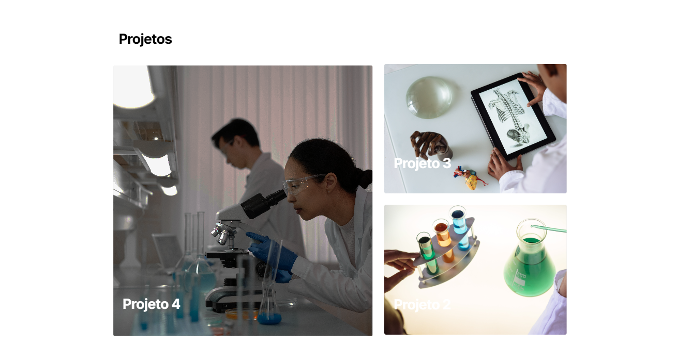

# Documentação do Projeto LECE

## Visão Geral

O LECE é um site desenvolvido utilizando a plataforma WordPress para facilitar a organização de conteúdo. 

- **URL do Site:** [www.lece.uerj.br](http://www.lece.uerj.br)
- **Tela de Login:** [www.lece.uerj.br/wp-admin](http://www.lece.uerj.br/wp-admin)

Para acessar o painel administrativo do site e fazer edições, você precisará fazer login utilizando um nome de usuário e senha.

## Estrutura do Site

### Páginas Principais

1. **Página Inicial:** Descrição breve do site e destaques recentes.
2. **Sobre Nós:** Informações sobre a equipe ou a organização por trás do site.
3. **Produtos:** Detalhes sobre os produtos oferecidos.
4. **Projetos:** Informações sobre projetos realizados.
5. **Notícias:** Artigos e atualizações relacionadas ao tema do site.
6. **Contato:** Formulário de contato e informações de localização.

## Header

O cabeçalho (header) do site LECE é composto pelos seguintes elementos:

- **Logo:** A logo do site, que é fixa e sempre visível no cabeçalho.
- **Menu Fixo:** O menu de navegação, que inclui links para as páginas principais: Home, Sobre Nós, Produtos, Projetos, Notícias, Contato. Esse menu é fixo e sempre visível no cabeçalho.
- **Campo de Busca:** Um campo para buscar conteúdo dentro do site.
- **Botão de Menu:** Um botão que, ao ser clicado, abre o menu de navegação em dispositivos móveis.

## Página Inicial

A página inicial do site LECE apresenta as seguintes características:

- **Carrossel de Destaques:** Um carrossel de imagens que podem ser adicionadas e configuradas através do painel do Elementor. Cada imagem pode ter um link de redirecionamento para outras páginas do site.
- **Seção de Artigos Recentes:** Uma seção fixa com o título "Artigos Recentes" que redireciona para uma página de notícias ou blog do site.
- **Seção de Projetos:** Uma seção fixa com o título "Projetos" que redireciona para uma página de projetos do site.
> Esta seção requer suporte técnico para qualquer alteração.

## Sobre Nós

A seção "Sobre Nós" apresenta informações sobre o laboratório LECE.
> Esta seção requer suporte técnico para qualquer alteração.

## Linha de Atuação

A seção "Linha de Atuação" apresenta as seguintes características:

- Permite adicionar múltiplas opções que explicam sobre as áreas de atuação do laboratório LECE.
- Cada opção pode ser configurada para redirecionar para um post específico da categoria correspondente.
> Esta seção requer suporte técnico para qualquer alteração.

## Postagens

A seção "Postagens" exibe os posts da categoria "post". Aqui estão os posts mais recentes dessa categoria. Para adicionar um novo post, certifique-se de categorizá-lo como "post".

## Projetos

A seção "Projetos" apresenta os últimos projetos publicados. Ela exibe três projetos que foram categorizados como "Projetos" ao publicá-los. Para adicionar um novo projeto, é necessário criar uma nova postagem e atribuir a categoria "Projetos".

## Equipe

A seção "Equipe" apresenta os integrantes do laboratório LECE, juntamente com uma breve descrição sobre a carreira de cada um. 
> Esta seção requer suporte técnico para qualquer alteração.

## Parceiros

A seção "Parceiros" apresenta os parceiros do laboratório LECE, mostrando o ícone de cada parceiro. 
> Esta seção requer suporte técnico para qualquer alteração.

## Formulário de Contato

O formulário de contato permite que os visitantes entrem em contato com o laboratório LECE. As mensagens enviadas através deste formulário serão recebidas por e-mail. 
> Esta seção requer suporte técnico para qualquer alteração.

## Produtos

A página de produtos lista as postagens categorizadas como "Produtos". Esta seção exibe os produtos disponíveis no laboratório LECE.

## Gerenciamento de Conteúdo

### Como Publicar/Atualizar Artigos no Blog

1. Faça login no painel administrativo do WordPress.
2. No menu lateral, selecione "Posts".
3. Para adicionar um novo artigo, clique em "Adicionar Novo". Para editar um artigo existente, clique no título do artigo desejado.
4. Utilize o editor do WordPress para escrever o conteúdo do artigo.
5. Após concluir as edições, clique em "Publicar" para publicar um novo artigo ou "Atualizar" para atualizar um artigo existente.

## Suporte

Se precisar de assistência adicional ou encontrar algum problema, entre em contato conosco através do formulário de contato disponível no site ou envie um e-mail para luizrtr@outlook.com.
